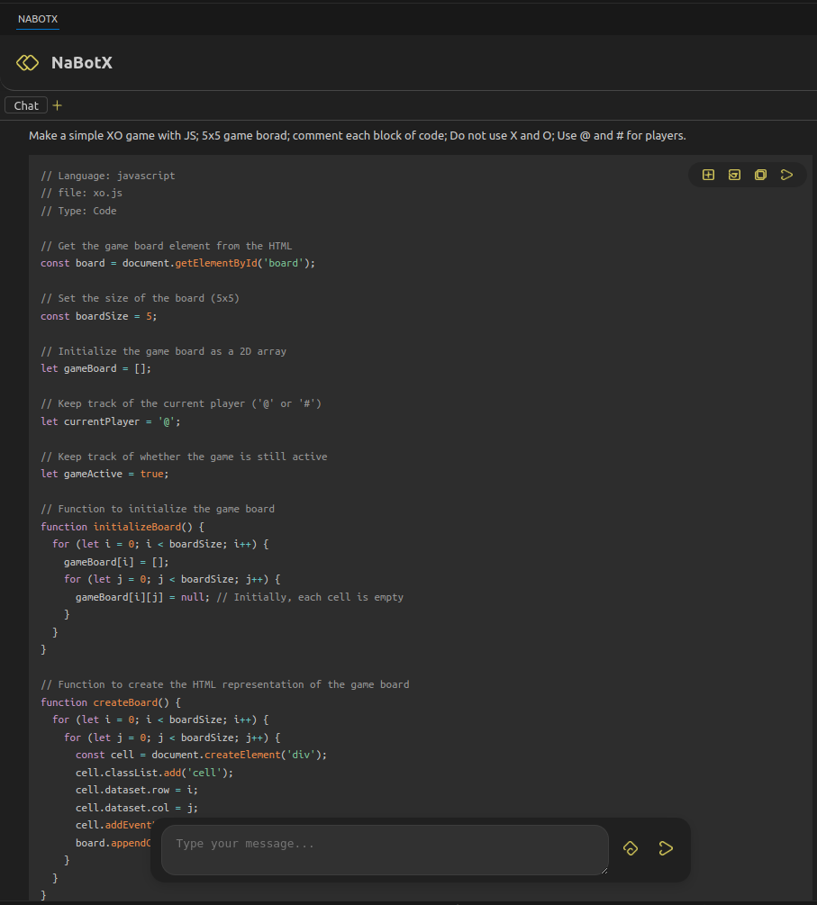

# NaBotX

NabotX is a VSCode extension designed to boost developer productivity by providing AI-assisted coding features. It offers a lightweight and privacy-conscious tool, helping you write code faster and with greater accuracy.

## Features
- AI-powered code completion and suggestions
- Supports connecting to your own LLM instance (local or web-hosted)
- Full control over where your code is processed — no code is sent to external servers unless you choose
- Supports multiple programming languages
- Lightweight and fast
- Easy to install and configure

## Extension LLM Configuration
- Hit `Ctrl+Shift+P`, search for NaBotX and open `NaBotX: Open Settings` 

## Future Works
- [ ] Add new chat
- [ ] Add new task
- [ ] Show diagrams
- [ ] Add image
- [ ] Generate image
- [ ] Automate tests

## Compile
- Install vsce `npm install -g vsce`
- And use it `vsce package`

## License
This project is licensed under the Apache License 2.0. See the [LICENSE](./LICENSE) file for details.