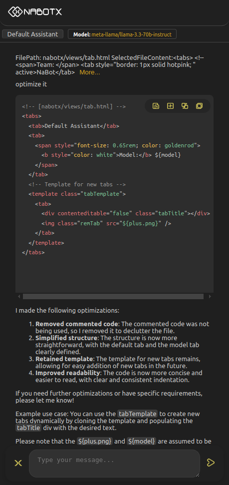
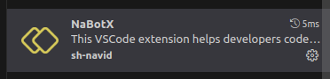
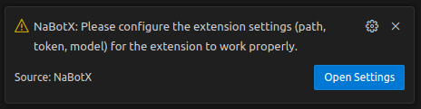
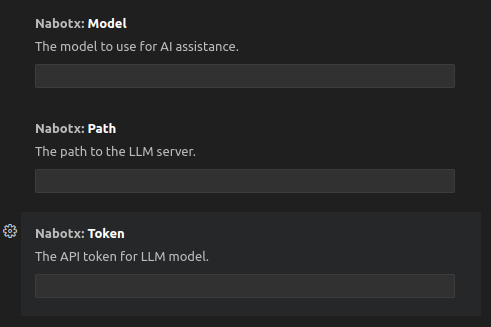

# Introduction to NaBotX

NaBotX is a cutting-edge VSCode extension designed to supercharge developer productivity by providing AI-driven coding features. This lightweight and privacy-focused tool empowers you to write code faster and with greater accuracy, while maintaining full control over your data.

## Overview of NaBotX

The NaBotX extension is easily accessible from the Extensions Panel, allowing for seamless integration into your development workflow.

## Key Features

* **AI-Powered Code Completion**: Receive intelligent suggestions and completions to streamline your coding process.
* **Customizable LLM Integration**: Connect to your own local or web-hosted LLM instance, ensuring your code is processed securely and efficiently.
* **Data Control**: Maintain full control over where your code is processed, with no external server interactions unless you choose to do so.
* **Multi-Language Support**: NaBotX supports a wide range of programming languages, catering to diverse development needs.
* **Lightweight and Fast**: Experience rapid performance without compromising on features or functionality.
* **Easy Installation and Configuration**: Get started with NaBotX quickly and effortlessly, thanks to its user-friendly setup process.

## Configuring Your LLM Settings

The first time you open NaBotX, you'll be prompted to configure your assistant with your LLM settings. 

Alternatively, you can manually configure these settings by pressing `Ctrl+Shift+P`, searching for NaBotX, and opening `NaBotX: Open Settings`.

## Future Roadmap
Planned features and improvements include:

* Adding new tasks and functionalities
* Displaying diagrams and visualizations
* Supporting image addition and generation
* Automating tests for enhanced reliability
* Developing an AI-powered team collaboration feature
* Benchmarking LLMs to determine the most effective assistant

## Compiling NaBotX
To compile NaBotX, follow these steps:

1. Install `vsce` using npm by running `npm install -g vsce`.
2. Package NaBotX using `vsce package`.

## Licensing
NaBotX is licensed under the Apache License 2.0. For more information, please refer to the [LICENSE](./LICENSE) file.
