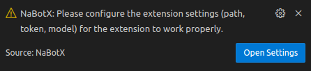

# NaBotX: Your AI-Powered VSCode Assistant

NaBotX is a VSCode extension designed to boost developer productivity with AI-driven coding assistance. This lightweight and privacy-focused tool helps you write code faster and more accurately, while ensuring you retain complete control over your data.

## Latest Release
- [NaBoTX-Release-V0.1.99](https://github.com/sh-navid/NabotX/releases/tag/Release-V0.1.99)

## NaBotX Overview

NaBotX integrates seamlessly into your workflow via the VSCode Extensions Panel.

## Key Features

*   **Intelligent Code Completion:** Get smart suggestions and code completions, making coding smoother and faster.
*   **Customizable LLM Integration:** Connect to your preferred LLM, whether it's running locally or hosted online, ensuring secure and efficient code processing.
*   **Full Data Control:** Your code stays where you want it. NaBotX doesn't interact with external servers unless *you* configure it to.
*   **Broad Language Support:** Supports a wide variety of programming languages.
*   **Lightweight & Performant:** Experience fast performance.

## Configuring Your LLM

The first time you launch NaBotX, you'll be prompted to configure your LLM settings.

You can also manually configure these settings by pressing `Ctrl+Shift+P`, typing "NaBotX" and selecting "NaBotX: Open Settings."

## Usage Instructions

NaBotX offers multiple ways to interact:

*   **Direct Prompting:** Send your prompt directly to the NaBotX chat window.
*   **Contextual Chat ("Add 2 Chat"):**
    *   Right-click on a file or folder in the Explorer and select "Add File/Folder to chat".
    *   Select text within a file, right-click, and choose "Add to chat".
    *   Then, send your prompt.
*   **Predefined Commands:** Use the following commands within the chat:
    *   `/structure`: Sends your project structure to the chat.  Useful for giving the LLM context.
    *   `/date`: Sends the current date to the chat.
    *   `/time`: Sends the current time to the chat.

## Roadmap

Future development plans include:

*   Adding new tasks and functionalities to streamline common development workflows.
*   Displaying diagrams and visualizations within the chat.
*   Supporting image addition and generation capabilities.
*   Automating tests to improve code reliability.
*   Developing AI-powered features for team collaboration.
*   Benchmarking different LLMs to identify the most effective assistant for various tasks.

## Compilation Instructions

To compile NaBotX from source:

1.  Install `vsce` (Visual Studio Code Extensions) globally using npm: `npm install -g vsce`
2.  Package the extension using the command: `vsce package`

Alternatively, you can use the provided [CompileScript](./compile.py).

## Licensing
NaBotX is released under the Apache License 2.0. See the [LICENSE](./LICENSE) file for complete license information.