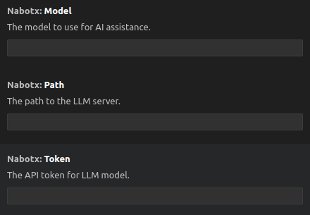

# N8X: Your AI-Powered VSCode Assistant

<p align="center">
  
</p>

N8X (formerly known as NaBotX) is a VSCode extension designed to boost developer productivity with AI-driven coding assistance. This lightweight and privacy-focused tool helps you write code faster and more accurately, while ensuring you retain complete control over your data.

## Latest Release
- [N8X-Release-V0.1.99](https://github.com/sh-navid/NabotX/releases/tag/Release-V0.1.99)
- [N8X-Release-V0.2.74](https://github.com/sh-navid/NabotX/releases/tag/Release-V0.2.74)

## N8X Overview


## Key Features

*   **Intelligent Code Completion:** Get smart suggestions and code completions, making coding smoother and faster.
*   **Customizable LLM Integration:** Connect to your preferred LLM, whether it's running locally or hosted online, ensuring secure and efficient code processing.
*   **Full Data Control:** Your code stays where you want it. N8X doesn't interact with external servers unless *you* configure it to.
*   **Broad Language Support:** Supports a wide variety of programming languages.
*   **Lightweight & Performant:** Experience fast performance.

## Configuring Your LLM

The first time you launch N8X, you'll be prompted to configure your LLM settings.


You can also manually configure these settings by pressing `Ctrl+Shift+P`, typing "N8X" and selecting "N8X: Open Settings."



## Usage Instructions

N8X offers multiple ways to interact:

*   **Direct Prompting:** Send your prompt directly to the N8X chat window.
*   **Contextual Chat ("Add 2 Chat"):**
    *   Right-click on a file or folder in the Explorer and select "Add File/Folder to chat".
    *   Select text within a file, right-click, and choose "Add to chat".
    *   Then, send your prompt.
*   **Predefined Commands:** Use the following commands within the chat:
    *   `/structure`: Sends your project structure to the chat.  Useful for giving the LLM context.
    *   `/date`: Sends the current date to the chat.
    *   `/time`: Sends the current time to the chat.

## n8x.json
```json
{
  ...
  "excludeFromChat":[
    "/assets",
    "/showcase",
    "/node_modules",
    "*.vsix"
  ],
  ...
  "preference": [
    "Anything that should be always remembered for your project"
  ]
  ...
}
```

## Roadmap

Future development plans include:

*   Adding new tasks and functionalities to streamline common development workflows.
*   Displaying diagrams and visualizations within the chat.
*   Supporting image addition and generation capabilities.
*   Automating tests to improve code reliability.
*   Developing AI-powered features for team collaboration.
*   Benchmarking different LLMs to identify the most effective assistant for various tasks.

## Compilation Instructions

To compile N8X from source:

1. Install `vsce` (Visual Studio Code Extensions) globally using npm: `npm install -g vsce`
2. Package the extension using the command: `vsce package`
3. You can use the provided [Python Script](./pipeline.py):
  - `python3 pipeline.py`


## Test
- `npm run test`


## Licensing
N8X(NaBotX) is released under the Apache License 2.0. See the [LICENSE](./LICENSE) file for complete license information.

## Font Attribution

This project utilizes the Sansation font, designed by Bernd Montag.

License: [Creative Commons Attribution-ShareAlike 3.0 Unported](https://creativecommons.org/licenses/by-sa/3.0/)


## Dependency Attributions
 - FIXME